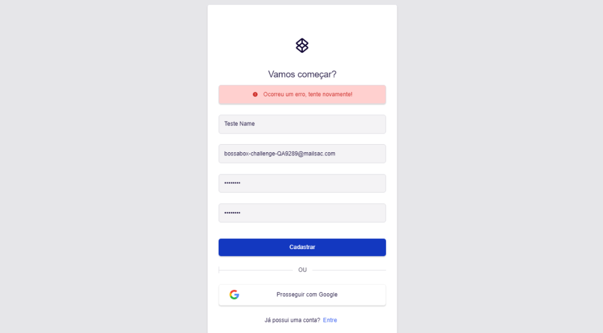
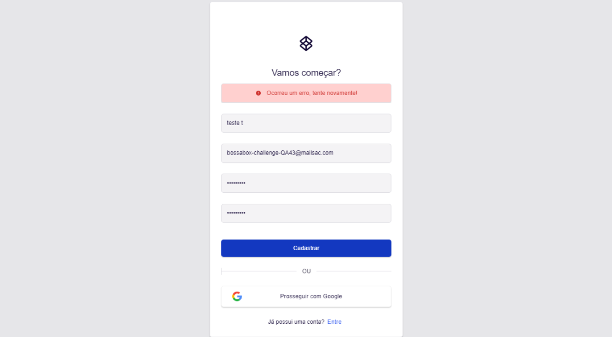
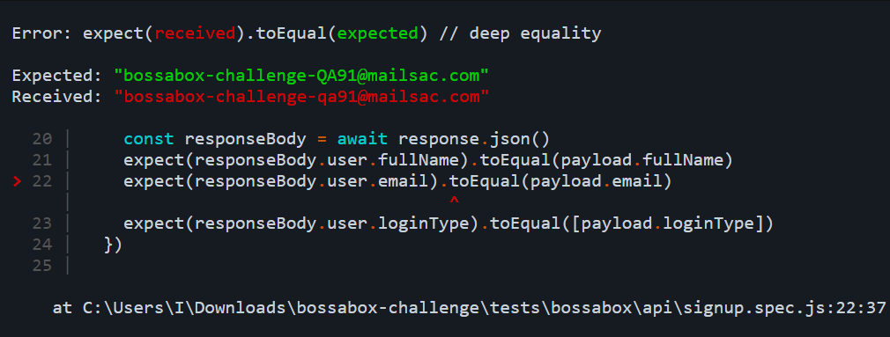
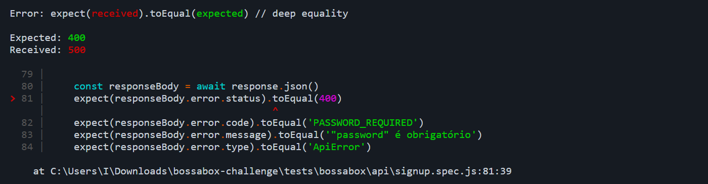
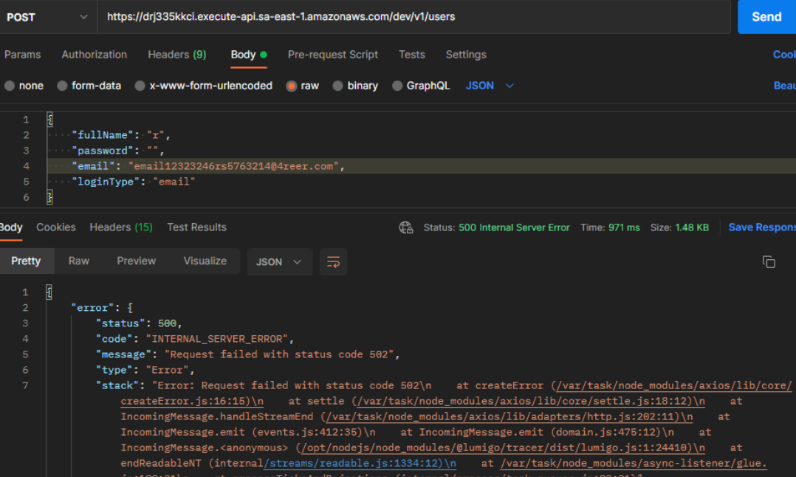
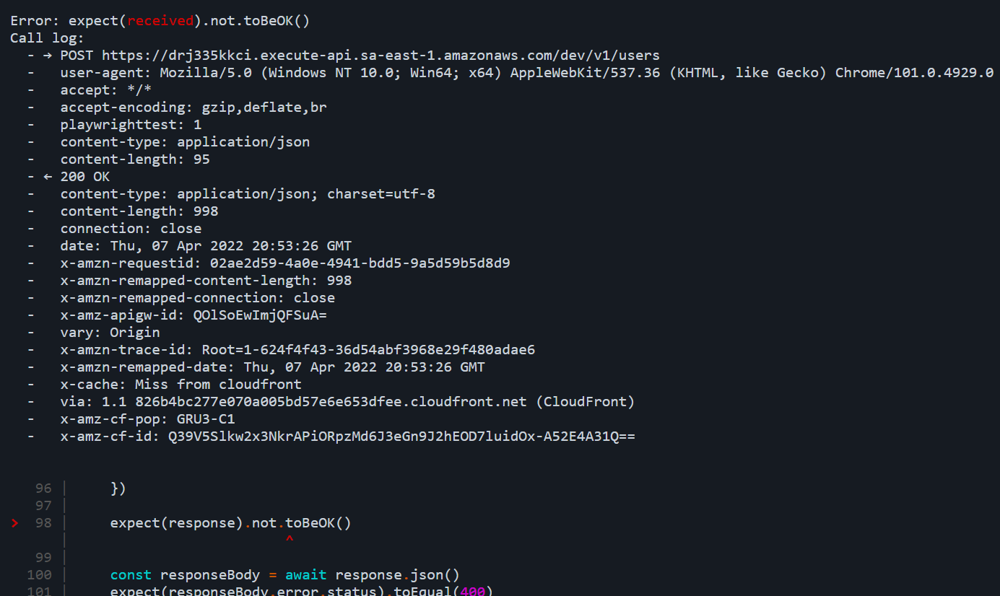
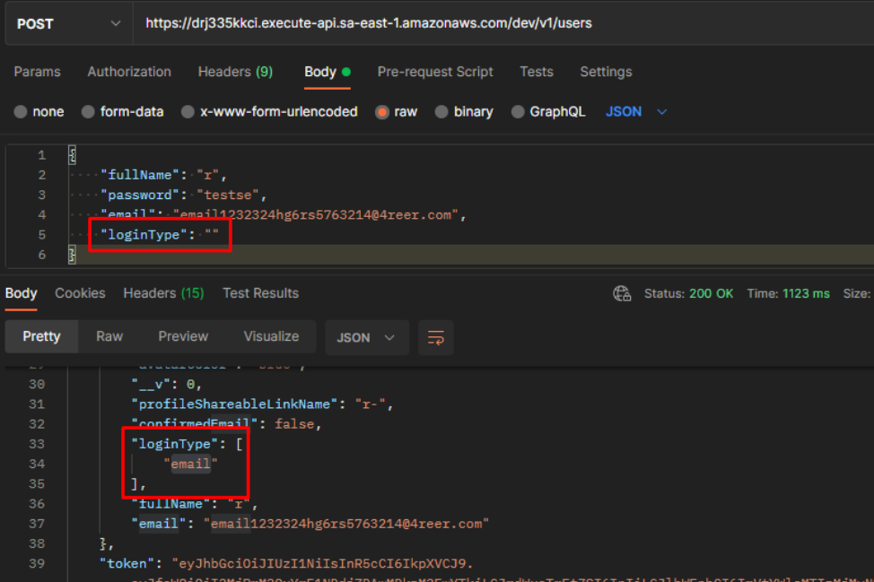

# [BossaBox]  Desafio QA - BUGS

Problemas encontrados (é possível reproduzir manualmente):

### Frontend 1. Timeout ao enviar formulári
o com dados válidos

Ao enviar formulário com dados válidos, a request na api não responde a tempo e resulta em timeout com a mensagem de erro: "`Ocorreu um erro, tente novamente!`".

Teste automatizado que identificou o erro: `@signup_success should be able to signup`

---
### Frontend 2. Timeout ao enviar formulário com email já cadastrado

Ao enviar formulário com email já cadastrado, a request na api não responde a tempo e resulta em timeout.

Teste automatizado que identificou o erro: `@signup_error @signup_email_already_registered should not be able to signup with email that already registered`

---
### Backend 1. Email cadastrado de forma errado ao enviar requisição com dados válidos

Ao enviar requisição com dados válidos, o email é salvo apenas com caracteres minúsculos (não está case sensitive).

Teste automatizado que identificou o erro: `should be able to signup by api`

---
### Backend 2. Erro interno no servidor ao enviar requisição com senha em branco

Ao enviar requisição com senha em branco, a api retorna erro 500, porém deveria ser retornado erro 400, validando a obrigatoriedade do campo. O erro 500 provavelmente ocorre pelo backend estar tentando fazer um hash do campo, o qual é null.

Teste automatizado que identificou o erro: `should not be able to signup by api with empty password`

Além disso, segue evidência do postman para melhor visualização do payload e response:

---
### Backend 3. Cadastro realizado ao enviar LoginType vazio

Ao enviar uma requisição com loginType vazio, o cadastro é realizado com loginType `email`. Como isso não foi informado como regra de negócio, será tratado como erro.

Teste automatizado que identificou o erro: `should not be able to signup by api with empty loginType`

Além disso, segue evidência do postman para melhor visualização do payload e response:

